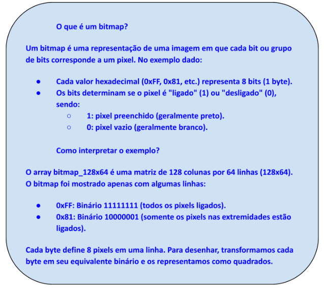

# Display OLED

## Atividade: Configurando e Usando o Display OLED da BitDogLab com Linguagem C

A seguir, apresentaremos um passo a passo para configurar e programar o Display OLED da BitDogLab utilizando a linguagem C. Vamos criar um programa que escreve uma mensagem no display, explorando as funções básicas de inicialização, configuração e manipulação de texto.

### Objetivo:

Desenvolver um programa que configure o Display OLED da BitDogLab e exiba uma mensagem personalizada. O programa deve inicializar a comunicação com o display, configurar os parâmetros de operação e atualizar a tela com a mensagem desejada.

### Desenvolvimento:

**Passo 1:** Configuração do Ambiente

Antes de iniciar a programação, certifique-se de que o ambiente de desenvolvimento está configurado:

- Conecte a BitDogLab ao computador utilizando um cabo USB.
- Abra o VS Code e carregue o projeto com a estrutura de pastas para compilar e executar código em C na BitDogLab.
- Verifique se as bibliotecas necessárias estão instaladas:
  - [ssd1306.h](https://github.com/BitDogLab/BitDogLab-C/blob/main/display_oled/inc/ssd1306.h) para reconhecer as funções do código C. OBS: Esta biblioteca está disponível no link ativo.
  - [ssd1306 font.h](https://github.com/BitDogLab/BitDogLab-C/blob/main/display_oled/inc/ssd1306_font.h) para obter os desenhos no display para cada caractere singular. Disponível no link ativo.
  - [ssd1306_i2c.h](https://github.com/BitDogLab/BitDogLab-C/blob/main/display_oled/inc/ssd1306_i2c.h) para controlar o Display OLED. Disponível no link ativo.
  - [ssd1306_i2c.c](https://github.com/BitDogLab/BitDogLab-C/blob/main/display_oled/inc/ssd1306_i2c.c) para declarar as funções ativas do código C. Disponível no link ativo.
  - Certifique-se de incluir os arquivos ssd1306.h, ssd1306_font.h, ssd1306_i2c.h e ssd1306_i2c.c numa pasta separada (de nome “inc”) dentro do projeto.
  - Drivers para comunicação I2C.

**Passo 2:** Entendimento da Configuração do Hardware

- O Display OLED está conectado ao barramento I2C da BitDogLab através dos seguintes pinos:
  - SDA: GPIO14
  - SCL: GPIO15
- O endereço do Display OLED é 0x3C.

**Passo 3:** Escrevendo o Código

- Inicialização do I2C e do Display OLED – Inclua as bibliotecas necessárias e inicialize a comunicação com o display:

```c
#include <stdio.h>
#include <string.h>
#include <stdlib.h>
#include <ctype.h>
#include "pico/stdlib.h"
#include "pico/binary_info.h"
#include "inc/ssd1306.h"
#include "hardware/i2c.h"

const uint I2C_SDA = 14;
const uint I2C_SCL = 15;

int main()
{
    stdio_init_all();   // Inicializa os tipos stdio padrão presentes ligados ao binário

    // Inicialização do i2c
    i2c_init(i2c1, ssd1306_i2c_clock * 1000);
    gpio_set_function(I2C_SDA, GPIO_FUNC_I2C);
    gpio_set_function(I2C_SCL, GPIO_FUNC_I2C);
    gpio_pull_up(I2C_SDA);
    gpio_pull_up(I2C_SCL);

    // Processo de inicialização completo do OLED SSD1306
    ssd1306_init();

    // Preparar área de renderização para o display (ssd1306_width pixels por ssd1306_n_pages páginas)
    struct render_area frame_area = {
        start_column : 0,
        end_column : ssd1306_width - 1,
        start_page : 0,
        end_page : ssd1306_n_pages - 1
    };

    calculate_render_area_buffer_length(&frame_area);

    // zera o display inteiro
    uint8_t ssd[ssd1306_buffer_length];
    memset(ssd, 0, ssd1306_buffer_length);
    render_on_display(ssd, &frame_area);

restart:
```

- Exibição de Mensagem no Display – Crie uma função para escrever texto no Display OLED (no arquivo ssd1306_i2c.c) e chame-a no código principal:

```c
// Desenha uma string, chamando a função de desenhar caractere várias vezes

void ssd1306_draw_string(uint8_t *ssd, int16_t x, int16_t y, char *string) {
    if (x > ssd1306_width - 8 || y > ssd1306_height - 8) {
        return;
    }

    while (*string) {
        ssd1306_draw_char(ssd, x, y, *string++);
        x += 8;
    }
}
```

```c
char *text[] = {
        "  Bem-vindos!   ",
        "  Embarcatech   "};

    int y = 0;
    for (uint i = 0; i < count_of(text); i++)
    {
        ssd1306_draw_string(ssd, 5, y, text[i]);
        y += 8;
    }
    render_on_display(ssd, &frame_area);

    while(true) {
        sleep_ms(1000);
    }

    return 0;
}
```

O código completo pode ser acessado [neste link](https://github.com/BitDogLab/BitDogLab-C/blob/main/display_oled/display_oled.c).

**Passo 4:** Compilação e Execução

- Compile o código no VS Code.
- Carregue o programa na BitDogLab.
- Observe a mensagem "Bem-vindos!" e "Embarcatech" no Display OLED.

### Exploração Adicional:

- Modifique a mensagem para exibir seu nome ou outro texto personalizado.
- Experimente mudar a posição do texto no display ajustando os valores de x e y.
- Tente adicionar animações simples, como rolagem de texto ou texto piscando.

### Dica Importante:

Sempre chame a função render_on_display após modificar o buffer do display para garantir que as alterações sejam exibidas.

## Atividade: Desenhando Linhas no Display OLED da BitDogLab com o Algoritmo de Bresenham

Nesta atividade, exploraremos como desenhar linhas no Display OLED da BitDogLab utilizando a linguagem C. Para isso, aplicaremos o algoritmo de Bresenham, amplamente usado em sistemas gráficos por sua eficiência no cálculo de pontos de uma linha reta.

### Objetivo:

- Compreender como um algoritmo pode ser implementado para trabalhar com gráficos baseados em pixels.
- Aprender a manipular pixels no Display OLED.
- Estimular o raciocínio matemático aplicado à programação.

Esta atividade é ideal para introduzir conceitos de gráficos computacionais e controle de hardware gráfico.

### Desenvolvimento:

**Passo 1:** Função do Algoritmo de Bresenham

O algoritmo de Bresenham calcula os pontos de uma linha entre dois pontos cartesianos (x_0, y_0) e (x_1, y_1) e acende os pixels correspondentes no display.

```c
// Função do Algoritmo de Bresenham
void ssd1306_draw_line(uint8_t *ssd, int x_0, int y_0, int x_1, int y_1, bool set) {
    int dx = abs(x_1 - x_0); // Deslocamentos
    int dy = -abs(y_1 - y_0);
    int sx = x_0 < x_1 ? 1 : -1; // Direção de avanço
    int sy = y_0 < y_1 ? 1 : -1;
    int error = dx + dy; // Erro acumulado
    int error_2;

    while (true) {
        ssd1306_set_pixel(ssd, x_0, y_0, set); // Acende pixel no ponto atual
        if (x_0 == x_1 && y_0 == y_1) {
            break; // Verifica se o ponto final foi alcançado
        }

        error_2 = 2 * error; // Ajusta o erro acumulado

        if (error_2 >= dy) {
            error += dy;
            x_0 += sx; // Avança na direção x
        }
        if (error_2 <= dx) {
            error += dx;
            y_0 += sy; // Avança na direção y
        }
    }
}
```

<details>

<summary>Comentários do Código</summary>
  
### Explicando as variáveis:

- dx e dy: Distâncias absolutas em cada eixo, definindo a inclinação da linha.
- sx e sy: Direção de movimento nos eixos x e y, dependendo do ponto inicial e final.
- Erro acumulado (error): Usado para decidir se o próximo ponto avança no eixo principal ou secundário.
- Chamada de ssd1306_set_pixel: Marca cada ponto da linha no buffer do display.
</details>

**Passo 2:** Programa Principal

Este programa utiliza a função de Bresenham para desenhar uma linha no display, conectando os pontos (10, 10) e (100, 50).

```c
#include <stdio.h>
#include <string.h>
#include <stdlib.h>
#include <ctype.h>
#include "pico/stdlib.h"
#include "pico/binary_info.h"
#include "inc/ssd1306.h"
#include "hardware/i2c.h"

const uint I2C_SDA = 14;
const uint I2C_SCL = 15;

int main()
{
    stdio_init_all();   // Inicializa os tipos stdio padrão presentes ligados ao binário

    // Inicialização do i2c
    i2c_init(i2c1, ssd1306_i2c_clock * 1000);
    gpio_set_function(I2C_SDA, GPIO_FUNC_I2C);
    gpio_set_function(I2C_SCL, GPIO_FUNC_I2C);
    gpio_pull_up(I2C_SDA);
    gpio_pull_up(I2C_SCL);

    // Processo de inicialização completo do OLED SSD1306
    ssd1306_init();

    // Preparar área de renderização para o display (ssd1306_width pixels por ssd1306_n_pages páginas)
    struct render_area frame_area = {
        start_column : 0,
        end_column : ssd1306_width - 1,
        start_page : 0,
        end_page : ssd1306_n_pages - 1
    };

    calculate_render_area_buffer_length(&frame_area);

    // zera o display inteiro
    uint8_t ssd[ssd1306_buffer_length];
    memset(ssd, 0, ssd1306_buffer_length);
    render_on_display(ssd, &frame_area);

restart:

    ssd1306_draw_line(ssd, 10, 10, 100, 50, true);
    render_on_display(ssd, &frame_area);

    while(true) {
        sleep_ms(1000);
    }

    return 0;
}
```

<details>

<summary>Comentários do Código</summary>

### Explicando cada parte:

- Inicialização do I2C:
  - Configura a comunicação I2C no barramento correto (SDA: GPIO14, SCL: GPIO15).
  - Ajusta a velocidade para 400 kHz.
- Inicialização do Display OLED:
  - Usa ssd1306_init para preparar o display.
- Chamada de ssd1306_draw_line:
  - Desenha a linha no buffer usando a função de Bresenham.
- Atualização do Display:
  - Chama render_on_display para exibir os dados do buffer no hardware.

</details>

### Exploração Adicional:

- Desenhe múltiplas linhas para criar figuras geométricas, como triângulos ou retângulos.
- Modifique os pontos de início e fim para explorar diferentes inclinações de linhas.
- Use botões ou um joystick para desenhar linhas interativamente no display.

### Dica Importante:

Lembre-se de sempre chamar a função render_on_display após modificar o buffer para que as alterações sejam exibidas no display.

## Atividade: Exibindo Bitmaps no Display OLED da BitDogLab

Nesta atividade, vamos aprender a exibir uma imagem monocromática no Display OLED presente na BitDogLab. As imagens serão importadas como bitmaps no formato 128x64, adequado para a resolução do display. Essa atividade é uma excelente oportunidade para entender como gráficos são manipulados em dispositivos embarcados.

Para representar um bitmap monocromático no Display OLED, precisamos traduzir a imagem para uma matriz de bytes. Cada byte da matriz representa uma coluna de 8 pixels (uma "página" vertical) no display, seguindo o modelo de mapeamento do controlador SSD1306. Este formato compacto e eficiente permite que gráficos sejam exibidos diretamente no hardware.

A seguir, apresentaremos um guia detalhado que inclui:

- Como criar ou converter imagens para o formato 128x64 monocromático.
- Como estruturar e integrar a matriz de bytes no código.
- Como exibir o bitmap no Display OLED utilizando linguagem C.

Ao final, você será capaz de importar e exibir imagens personalizadas no display, explorando novas possibilidades para suas aplicações gráficas embarcadas!

### Desenvolvimento:

**Passo 1:** Converter a Imagem para Bitmap

- Use uma ferramenta gráfica (como GIMP ou um conversor online) para criar ou editar uma imagem de 128x64 pixels.
- Exporte a imagem no formato monocromático (1-bit, preto e branco) e salve-a como uma matriz de bytes.
- O resultado será uma matriz de bytes em formato hexadecimal, onde cada bit representa um pixel (1 para ligado, 0 para desligado).

Exemplo de matriz de bitmap (imagem simples):

```c
const uint8_t bitmap_128x64[] = {
    0xFF, 0x81, 0x81, 0xFF,  // Padrão de quadrado (exemplo)
    0x81, 0x81, 0x81, 0xFF,  // Continuação do padrão
    // Adicione mais linhas para completar 128x64
};
```



**Passo 2:** Código para Renderizar o Bitmap no Display OLED

- Função para Desenhar o Bitmap – Crie uma função que copie os dados do bitmap para o buffer do display.

```c
void ssd1306_draw_bitmap(ssd1306_t *ssd, const uint8_t *bitmap) {
    // Copia o bitmap para o buffer do display
    for (int i = 0; i < ssd->bufsize - 1; i++) {
        ssd->ram_buffer[i + 1] = bitmap[i]; // O buffer começa no índice 1
    }
    // Atualiza o display com os dados do buffer
    ssd1306_send_data(ssd);
}
```

- Programa Principal – Use a função ssd1306_draw_bitmap para carregar e exibir o bitmap no display.

```c
#include <stdio.h>
#include <string.h>
#include <stdlib.h>
#include <ctype.h>
#include "pico/stdlib.h"
#include "pico/binary_info.h"
#include "inc/ssd1306.h"
#include "hardware/i2c.h"

const uint I2C_SDA = 14;
const uint I2C_SCL = 15;

int main()
{
    stdio_init_all();   // Inicializa os tipos stdio padrão presentes ligados ao binário

    // Inicialização do i2c
    i2c_init(i2c1, ssd1306_i2c_clock * 1000);
    gpio_set_function(I2C_SDA, GPIO_FUNC_I2C);
    gpio_set_function(I2C_SCL, GPIO_FUNC_I2C);
    gpio_pull_up(I2C_SDA);
    gpio_pull_up(I2C_SCL);

    // Processo de inicialização completo do OLED SSD1306
    ssd1306_init();

    // Preparar área de renderização para o display (ssd1306_width pixels por ssd1306_n_pages páginas)
    struct render_area frame_area = {
        start_column : 0,
        end_column : ssd1306_width - 1,
        start_page : 0,
        end_page : ssd1306_n_pages - 1
    };

    calculate_render_area_buffer_length(&frame_area);

    // zera o display inteiro
    uint8_t ssd[ssd1306_buffer_length];
    memset(ssd, 0, ssd1306_buffer_length);
    render_on_display(ssd, &frame_area);

restart:

    const uint8_t bitmap_128x64[] = {
        0xFF, 0x81, 0x81, 0xFF,  // Padrão de quadrado (exemplo)
        0x81, 0x81, 0x81, 0xFF,  // Continuação do padrão
        // Adicione mais linhas para completar 128x64
        };

    ssd1306_t ssd_bm;
    ssd1306_init_bm(&ssd_bm, 128, 64, false, 0x3C, i2c1);
    ssd1306_config(&ssd_bm);

    ssd1306_draw_bitmap(&ssd_bm, bitmap_128x64);

    while(true) {
        sleep_ms(1000);
    }

    return 0;
}
```

**Passo 3:** Como Testar

- Carregue o Programa: Compile o código e envie para a BitDogLab usando seu ambiente de desenvolvimento.
- Verifique a Imagem: A imagem definida no bitmap_128x64 será exibida no Display OLED.

### Dicas Adicionais:

- Ferramenta para Gerar Bitmaps:
  - Use o GIMP:
    - Crie uma imagem de 128x64 pixels.
    - Exporta como .xbm (C header file). O GIMP gera automaticamente um array de bytes para incluir no código.
- Formato de tamanho:
  - Certifique-se de que o tamanho do array seja exatamente 128x64 / 8 = 1024 bytes.

### Exploração Adicional:

- Combine a exibição de bitmaps com outras funções, como desenhar texto ou linhas, para criar interfaces gráficas dinâmicas.
- Com isso, você terá uma forma eficiente de exibir bitmaps no Display OLED da BitDogLab usando C!
